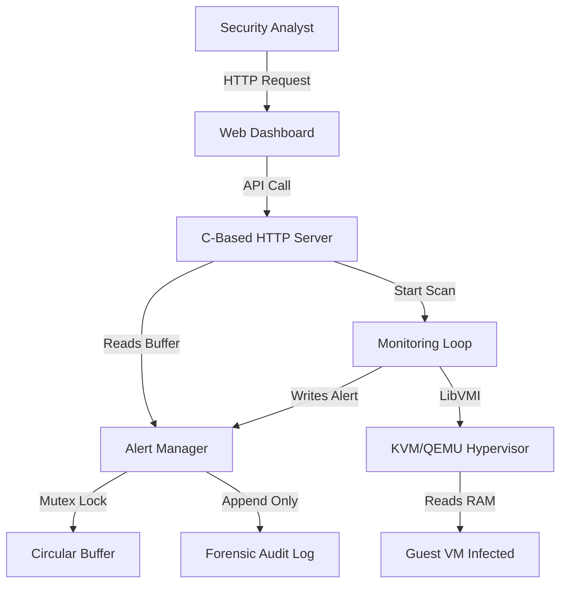

# Hypervisor-Based Rootkit Detection System

[](LICENSE)
[]()
[]()
[]()

A standalone, out-of-band security solution that detects kernel-level rootkits in Linux Virtual Machines using Hardware Virtualization (Intel VT-x).

## Table of Contents

- [About The Project](#about-the-project)
- [Key Features](#key-features)
- [System Architecture](#system-architecture)
- [Tech Stack](#tech-stack)
- [Installation and Setup](#installation-and-setup)
- [Usage](#usage)
- [Testing and Results](#testing-and-results)
- [Documentation](#documentation)
- [Contributing](#contributing)
- [License](#license)
- [Academic Context](#academic-context)

## About The Project

Traditional antivirus software runs inside the operating system it tries to protect. Modern Rootkits exploit this by hiding inside the kernel, blindfolding the AV and stealing data undetected.

This project solves that problem by moving the detection logic outside the guest OS. Using Virtual Machine Introspection (VMI) via the LibVMI library, this system monitors the physical memory of a Guest VM from the Host Hypervisor layer. It provides an unalterable "ground truth" of the system state, bypassing any lies the rootkits tell the operating system.

### Why This Matters

- **Tamper-Resistant:** The detector runs on the Host; the malware in the Guest cannot see, stop, or modify it.
- **Real-Time:** Scans memory every few seconds without stopping the VM.
- **Forensic Integrity:** Maintains an immutable, append-only log of all security events.

## Key Features

| Feature | Description |
| :--- | :--- |
| Hidden Process Detection | Compares the trusted process list (from physical memory traversal) against the untrusted list (from Guest OS) to find hidden PIDs. |
| Syscall Integrity Check | Validates the sys_call_table handlers to ensure they point to legitimate kernel text, detecting syscall hooks. |
| IDT Integrity Monitor | Checks the Interrupt Descriptor Table for hijacked vectors (limited by KPTI on newer kernels). |
| Heuristic Fallback | Scans physical memory for known rootkit signatures (e.g., Diamorphine, Adore-ng) when kernel symbols are unavailable (KASLR mitigation). |
| Dashboard | A custom C-based HTTP server with alerts and forensic logs. |
| Thread-Safe Alerting | Uses POSIX Mutexes and a Circular Buffer to handle concurrent detection threads without data corruption. |

## System Architecture

The system follows a Hybrid Three-Tier Client-Server Architecture:

1. **Presentation Tier:** Web Dashboard (HTML/CSS/JS) running in the browser.
2. **Application Tier:** Custom C HTTP Server + Detection Modules (Process, Syscall, IDT, Fallback).
3. **Data Tier:** LibVMI Engine interacting with KVM/QEMU Hypervisor to read Guest Physical Memory.


## Tech Stack

- **Language:** C (backend), JavaScript (frontend)
- **Libraries:** LibVMI, pthread, json-c
- **Hypervisor:** KVM/QEMU
- **Build System:** GNU Make

## Installation and Setup

### Prerequisites

- Ubuntu 22.04 LTS Host
- Intel VT-x or AMD-V enabled in BIOS
- Root privileges (`sudo`)

### 1. Install Dependencies

```bash
sudo apt update
sudo apt install build-essential libvmi-dev libjson-c-dev libvirt-dev qemu-kvm libvirt-daemon-system
```
### 2. Clone the Repository

```bash
git clone https://github.com/KhadijaI/Hypervisor-Based-Rootkit-Detection-using-Hardware-Virtualization.git
cd Hypervisor-Based-Rootkit-Detection-using-Hardware-Virtualization
```
### 3. Build the Project

```bash
make clean
make all
```
### 4. Configure Guest VM

Ensure your Guest VM has qemu-guest-agent installed for accurate process comparison (optional but recommended):

```bash
# Inside Guest VM
sudo apt install qemu-guest-agent
sudo systemctl enable qemu-guest-agent
sudo systemctl start qemu-guest-agent
```

## Usage

### 1. Start the Detector:

```bash
sudo ./vmi
```

### 2. Access the Dashboard:

Open your browser and navigate to:
http://localhost:5000

### 3. Monitor:

Click Discover VMs to detect running guests.
Click Start Monitoring on a specific VM.
View alerts in the Overview tab.
Check the detailed scans in the Processes, Syscalls, IDT, or Fallback tabs.

## Testing and Results

The system was validated against a clean Ubuntu 22.04 Guest VM and tested for stability over 50+ minutes.

| Metric | Result |
| :--- | :--- |
| CPU Overhead | < 2% (Idle between scans) |
| Memory Footprint | ~45 MB (Stable) |
| Detection Accuracy | Successfully identified hidden processes & syscall hooks in controlled tests |
| Stability | Zero crashes during extended monitoring |

## Documentation

For a deep dive into the algorithms, architecture, and theoretical background, please refer to the official thesis report included in the repository:

- [Thesis Report.pdf](Thesis_Report.pdf)
- [Software Requirements Specification (SRS)](docs/SRS.pdf)
- [Software Design Document (SDD)](docs/SDD.pdf)

## Contributing

Contributions are welcome! If you have suggestions for improving detection algorithms or UI enhancements:

1. Fork the Project
2. Create your Feature Branch (`git checkout -b feature/AmazingFeature`)
3. Commit your Changes (`git commit -m 'Add some AmazingFeature'`)
4. Push to the Branch (`git push origin feature/AmazingFeature`)
5. Open a Pull Request

## License

Distributed under the MIT License. See `LICENSE` for more information.

## Academic Context

This project was developed as a Final Year Project (FYP) for the **Bachelor of Science in Computer Science** at **COMSATS University Islamabad, Vehari Campus**.

- **Student:** Khadija Iqbal (FA20-BCS-035)
- **Supervisor:** Dr. Rab Nawaz


